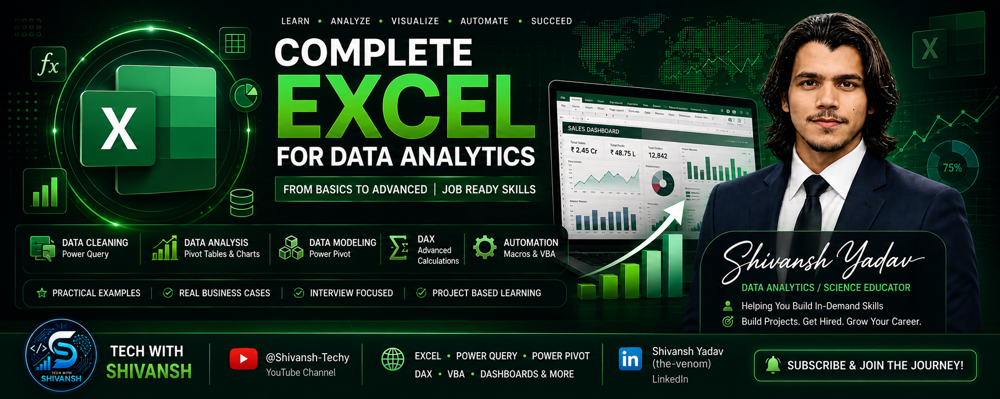
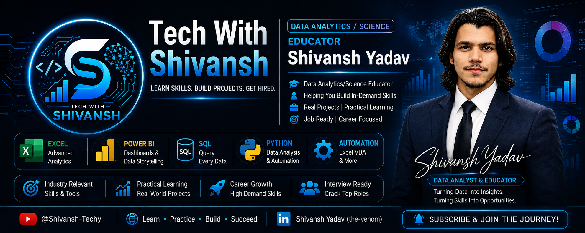

<div align="center">

<!-- ===================== BRAND HEADER ===================== -->



# 📊 COMPLETE EXCEL FOR DATA ANALYTICS
<p>
  <strong>🎓 Interview Oriented</strong>
  &nbsp; • &nbsp;
  <strong>💼 Business Focused</strong>
  &nbsp; • &nbsp;
  <strong>🛠️ Practical Learning</strong>
  &nbsp; • &nbsp;
  <strong>📊 Analytics Ready</strong>
</p>

<!-- ===================== DYNAMIC BADGES ===================== -->

<a href="https://youtube.com/playlist?list=PLMeZZ2Z8RDGQ">

</a>

<a href="https://youtube.com/@Techie-Shivansh">

</a>

<a href="https://www.linkedin.com/in/the-venom/">

</a>

<br><br>


<br><br>


</div>

---

# 📌 About This Repository

Welcome to the **Complete Excel for Data Analytics** repository by **Tech With Shivansh**.

This repository is designed as a complete practical learning resource for using **Microsoft Excel as a Data Analytics tool**.

It contains the supporting:

- 📘 Lecture Notes
- 📂 Practice Datasets
- 📊 Excel Workbooks
- 🧹 Data Cleaning Resources
- 🔄 Power Query Resources
- 🧩 Power Pivot & Data Modeling Resources
- 📐 DAX Examples
- 🤖 Macros & VBA Resources
- 💼 Business Use Cases
- 🎯 Interview-Oriented Material

The course follows a practical progression from **Excel fundamentals to advanced analytical workflows and automation**.

---

# 🎯 Course Goal

The goal is not simply to memorize Excel formulas.

The goal is to learn how to take:

> **Raw Business Data → Clean Data → Analyze → Visualize → Build Dashboard → Generate Insights → Automate**

The complete learning journey can be represented as:

```text
                RAW BUSINESS DATA
                       │
                       ▼
               ┌───────────────┐
               │ DATA CLEANING │
               └───────────────┘
                       │
                       ▼
             ┌───────────────────┐
             │ DATA TRANSFORMATION│
             └───────────────────┘
                       │
                       ▼
               ┌─────────────┐
               │ DATA ANALYSIS│
               └─────────────┘
                       │
                       ▼
             ┌──────────────────┐
             │ VISUALIZATION    │
             └──────────────────┘
                       │
                       ▼
              ┌────────────────┐
              │   DASHBOARD    │
              └────────────────┘
                       │
                       ▼
             ┌──────────────────┐
             │ BUSINESS INSIGHTS│
             └──────────────────┘
                       │
                       ▼
               ┌──────────────┐
               │ AUTOMATION   │
               └──────────────┘
```

---

# 🧠 What This Course Covers

The complete Excel analytics journey includes:

### Excel Core

* Excel Fundamentals
* Functions & Formulas
* Conditional Functions
* Logical Functions
* Text Functions
* Date & Time Functions
* Lookup & Reference Functions
* Error Handling
* Data Validation
* Conditional Formatting
* Dynamic Arrays

### Analytics

* Data Cleaning
* Pivot Tables
* Pivot Charts
* Slicers
* Timelines
* Business Charts
* Data Visualization
* Data Storytelling
* Dashboard Development
* Business Insights

### Advanced Excel

* Power Query
* ETL
* Advanced Transformations
* Query Combination
* Parameters
* M Language Awareness
* Power Pivot
* Data Modeling
* Fact & Dimension Tables
* Relationships
* Star Schema
* DAX
* Measures
* Calculated Columns
* Time Intelligence

### Automation

* Macros
* Macro Recorder
* VBA
* Recorded VBA Code
* Data Cleaning Automation
* Repetitive Task Automation

---

# 📚 Complete 16-Lecture Roadmap

| #  | Lecture           | Topic                                             |
| -- | ----------------- | ------------------------------------------------- |
| 01 | **Lecture 01**    | 📊 Excel Fundamentals & Core Functions            |
| 02 | **Lecture 02**    | 🧮 Conditional Aggregate & Logical Functions      |
| 03 | **Lecture 03**    | 🔤 Text Functions                                 |
| 04 | **Lecture 04**    | 📅 Date & Time Functions                          |
| 05 | **Lecture 05**    | 🔎 Lookup & Reference Functions                   |
| 06 | **Lecture 06**    | 🛡️ Error Handling & Data Validation              |
| 07 | **Lecture 07**    | 🎨 Conditional Formatting                         |
| 08 | **Lecture 08**    | ⚡ Dynamic Array Functions                         |
| 09 | **Lecture 09**    | 🧹 Data Cleaning in Excel                         |
| ⭐  | **Bonus Lecture** | 🚀 GitHub Portfolio & Excel Interview Preparation |
| 10 | **Lecture 10**    | 📈 Pivot Tables, Charts & Data Visualization      |
| 11 | **Lecture 11**    | 📊 Dashboard Development & Business Insights      |
| 12 | **Lecture 12**    | 🔄 Power Query: Data Import & Cleaning            |
| 13 | **Lecture 13**    | ⚙️ Advanced Power Query & ETL                     |
| 14 | **Lecture 14**    | 🧩 Power Pivot & Data Modeling                    |
| 15 | **Lecture 15**    | 📐 DAX for Excel                                  |
| 16 | **Lecture 16**    | 🤖 Macros & VBA for Analysts                      |

---

# 📂 Repository Structure

The repository follows the actual learning-resource structure.

```text
Complete-Excel-for-Data-Analytics/
│
├── assets/
│   ├── tech-with-shivansh-logo.png
│   └── excel-data-analytics-banner.png
│
├── Lecture_01/
│
├── Lecture_02_Part_1/
│
├── Lecture_02_Part_02/
│
├── Lecture_03/
│
├── Lecture_04/
│
├── Lecture_05/
│
├── Lecture_06/
│
├── Lecture_07/
│
├── Lecture_08/
│
├── Lecture_09/
│
├── Bonus_Lecture/
│
├── Lecture_10_Part_01/
│
├── Lecture_10_Part_02/
│
├── Lecture_10_Part_03/
│
├── Lecture_11/
│
├── Lecture_12/
│
├── Lecture_13/
│
├── Lecture_14/
│
├── Lecture_15/
│
├── Lecture_16/
│
└── README.md
``` 

> **Note:** The repository intentionally keeps the folder organization simple. The README acts as the navigation and curriculum guide.

---

# 🗂️ Folder → Lecture Mapping

| Folder               | Lecture            |
| -------------------- | ------------------ |
| `Lecture_01`         | Lecture 01         |
| `Lecture_02_Part_1`  | Lecture 02 Part 01 |
| `Lecture_02_Part_02` | Lecture 02 Part 02 |
| `Lecture_03`         | Lecture 03         |
| `Lecture_04`         | Lecture 04         |
| `Lecture_05`         | Lecture 05         |
| `Lecture_06`         | Lecture 06         |
| `Lecture_07`         | Lecture 07         |
| `Lecture_08`         | Lecture 08         |
| `Lecture_09`         | Lecture 09         |
| `Bonus_Lecture`      | Bonus Lecture      |
| `Lecture_10_Part_01` | Lecture 10 Part 01 |
| `Lecture_10_Part_02` | Lecture 10 Part 02 |
| `Lecture_10_Part_03` | Lecture 10 Part 03 |
| `Lecture_11`         | Lecture 11         |
| `Lecture_12`         | Lecture 12         |
| `Lecture_13`         | Lecture 13         |
| `Lecture_14`         | Lecture 14         |
| `Lecture_15`         | Lecture 15         |
| `Lecture_16`         | Lecture 16         |

---

# 🛠️ Technology Stack

<div align="center">

| Technology         | Purpose                 |
| ------------------ | ----------------------- |
| 🟢 Microsoft Excel | Core Analytics          |
| 🟢 Power Query     | Data Import & ETL       |
| 🟢 Power Pivot     | Data Modeling           |
| 🔵 DAX             | Analytical Calculations |
| 🟢 VBA             | Automation              |

</div>

---

# 🔄 End-to-End Excel Analytics Workflow

```text
┌───────────────────┐
│    RAW DATA       │
└─────────┬─────────┘
          ↓
┌───────────────────┐
│   DATA CLEANING   │
└─────────┬─────────┘
          ↓
┌───────────────────┐
│ DATA TRANSFORMATION│
└─────────┬─────────┘
          ↓
┌───────────────────┐
│   DATA MODELING   │
└─────────┬─────────┘
          ↓
┌───────────────────┐
│      DAX          │
└─────────┬─────────┘
          ↓
┌───────────────────┐
│  PIVOT / REPORT   │
└─────────┬─────────┘
          ↓
┌───────────────────┐
│    DASHBOARD      │
└─────────┬─────────┘
          ↓
┌───────────────────┐
│ BUSINESS INSIGHTS │
└─────────┬─────────┘
          ↓
┌───────────────────┐
│     AUTOMATION    │
└───────────────────┘
```

---

# 💼 Practical Business Applications

The concepts in this repository can be applied to:

### 📈 Sales Analytics

* Revenue Analysis
* Profit Analysis
* Product Performance
* Regional Performance
* Salesperson Performance
* Monthly Sales Trends
* KPI Reporting

### 👥 Customer Analytics

* Customer Performance
* Customer Segmentation
* Repeat Purchase Analysis
* Customer-Level Reporting

### 📦 Inventory Analytics

* Stock Monitoring
* Product Movement
* Inventory Reporting
* Reorder Analysis

### 💰 Financial Analytics

* Revenue Reporting
* Expense Analysis
* Profitability
* Budget Tracking
* Financial KPIs

### 🏢 Business Reporting

* Management Reports
* Operational Reports
* Executive Dashboards
* Recurring Reports
* Automated Reporting

---

# 🎯 Interview-Oriented Learning

The course follows a practical interview-oriented approach.

Learners are expected to understand not only:

> **"How does this Excel feature work?"**

but also:

> **"When would an analyst use it in a real business problem?"**

Key interview areas include:

* Excel Functions
* Lookup Functions
* Data Cleaning
* Pivot Tables
* Dashboards
* Power Query
* ETL
* Append vs Merge
* Join Concepts
* Data Modeling
* Fact & Dimension Tables
* Relationships
* Star Schema
* Measures
* Calculated Columns
* DAX
* Evaluation Context
* Time Intelligence
* Macros
* VBA
* Automation

---

# 🧪 Recommended Learning Method

For every lecture:

```text
WATCH
  ↓
  ↓  
UNDERSTAND
  ↓
  ↓  
READ NOTES
  ↓
  ↓  
PRACTICE
  ↓
  ↓  
REBUILD
  ↓
  ↓  
SOLVE BUSINESS PROBLEM
  ↓
  ↓  
ANSWER INTERVIEW QUESTIONS
  ↓
  ↓  
BUILD YOUR OWN VERSION
```

Do not simply copy the formulas or dashboards.

The real learning happens when you can reproduce the solution **without looking at the original file**.

---

# 📊 Skills Progression

```text
BEGINNER
   │
   ▼
Excel Fundamentals
   │
   ▼
Functions & Formulas
   │
   ▼
Data Cleaning
   │
   ▼
Data Analysis
   │
   ▼
Visualization
   │
   ▼
Dashboards
   │
   ▼
Power Query
   │
   ▼
Power Pivot
   │
   ▼
Data Modeling
   │
   ▼
DAX
   │
   ▼
VBA Automation
   │
   ▼
ANALYTICS-READY
```

---

# 📺 Complete YouTube Playlist

<div align="center">

<a href="https://youtube.com/playlist?list=PLMeZZ2Z8RDGQ">


</a>

</div>

---

# ▶️ Tech With Shivansh

<div align="center">




<a href="https://youtube.com/@shivansh-techy">


</a>

</div>


---

# 💼 Connect With Me

<div align="center">

<a href="https://www.linkedin.com/in/the-venom/">


</a>

---

# ⭐ Support the Repository

If this repository helps you:

⭐ Star the repository
🍴 Fork it
📢 Share it with other learners
💡 Practice the concepts
📊 Build your own analytics projects

---

# ⚠️ Disclaimer

This repository is created for **educational and practice purposes**.

Some datasets may be synthetic or specifically created for learning and demonstration.

Always validate data quality, assumptions and business logic before using analytical outputs for real-world business decisions.

---

# 🚀 Final Objective

The objective of this repository is simple:

> **Don't just learn Excel. Learn how to use Excel to solve business problems.**

```text
DATA
 ↓
CLEAN
 ↓
TRANSFORM
 ↓
ANALYZE
 ↓
VISUALIZE
 ↓
DASHBOARD
 ↓
INSIGHTS
 ↓
AUTOMATE
```

---

<div align="center">

# 📊 Learn Excel. Analyze Data. Build Insights.

### 🚀 Complete Excel for Data Analytics

### Tech With Shivansh

<br>


</div>
```
